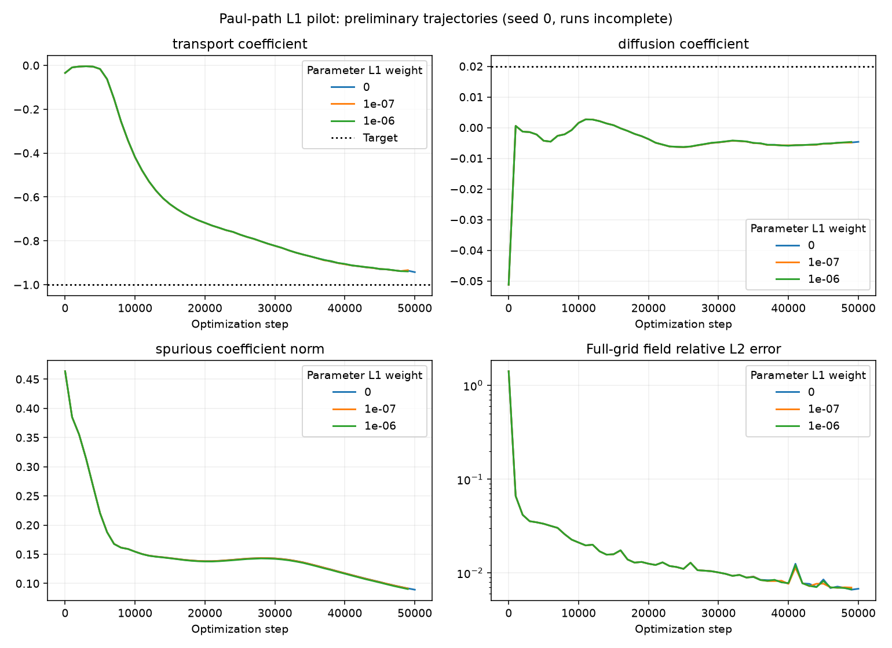

# Paul-path parameter L1: presentation snapshot

Snapshot UTC: 2026-10-07T20:38:59.469824+00:00

**Preliminary: the 100,000-step pilot is still running.** This is a compact presentation snapshot, not the final L1-strength comparison. Only three conditions have started; lambda 1e-5 and 1e-4 are queued.

## What is established

- The runner includes parameter L1 in the joint objective. Zero lambda matches the unregularized objective and gradients exactly.
- The loss and gradients match the original notebook loss code after including its already computed L1 term.
- At lambda 1e-4, the SymNet gradient difference norm is about 3.16225e-4. Direct SIREN penalty gradients are absent; future coupled trajectories may change.
- A matched float32 Adam step after ten common unregularized steps differs by 2.61264e-6 in SymNet parameters. First-step float32 rounding is covered separately by float64 checks.
- This penalizes internal factorized parameters, **not expanded physical PDE coefficients**.

## Current progress

|lambda|step|transport (target -1)|diffusion (target .02)|spurious L2|recovery|
|---|---|---|---|---|---|
|0|50000|-0.94265|-0.0046401|0.089301|none|
|1e-07|49000|-0.93357|-0.0048904|0.091444|none|
|1e-06|49000|-0.93943|-0.0046606|0.090388|none|
|1e-05|queued|—|—|—|—|
|0.0001|queued|—|—|—|—|

Files: `progress_summary.csv` contains current metrics and first recovery crossings; `trajectory_every_1000_steps.csv` contains all nine physical coefficients and five loss components; `field_metrics.csv` contains full-grid field errors. JSON files record mechanical validation and configuration.

Full histories, checkpoints, logs, older sparsity-sweep artifacts, and smoke plots are excluded to keep this presentation small. The complete artifacts remain local. Reproduce training with `runs/run_paul_path_l1.py`; protocol: `runs/PAUL_PATH_L1.md`. Use `build_snapshot.py --output <fresh-directory>` from the repository root to build a later snapshot.
