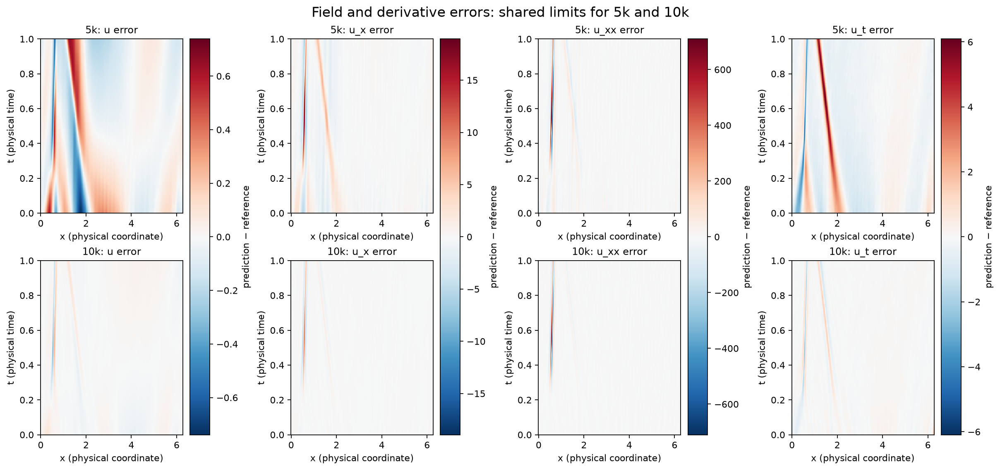
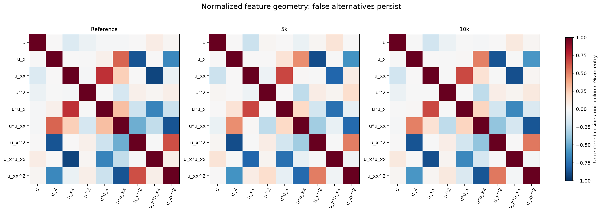
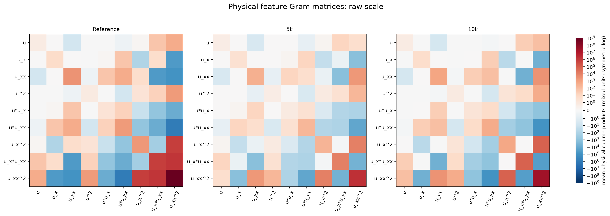
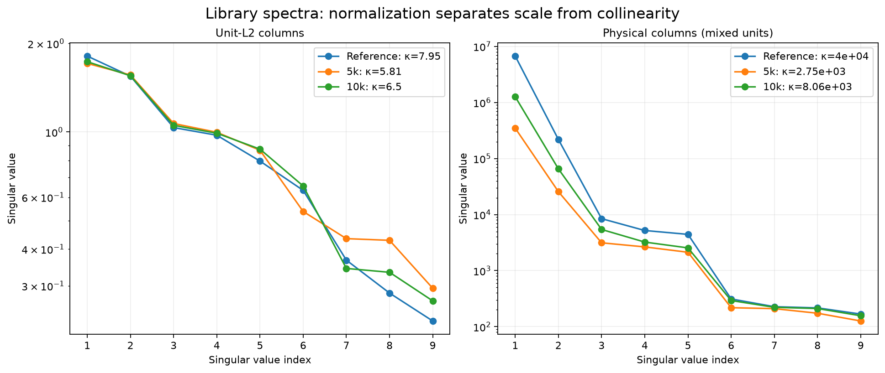
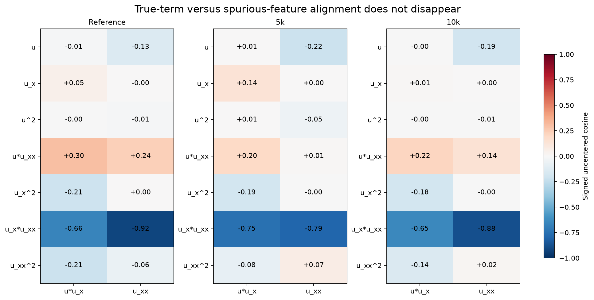
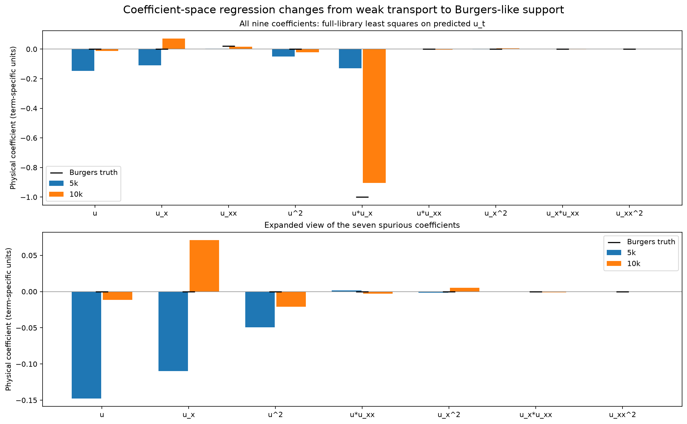
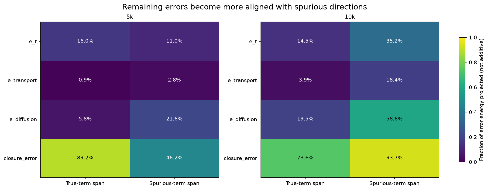
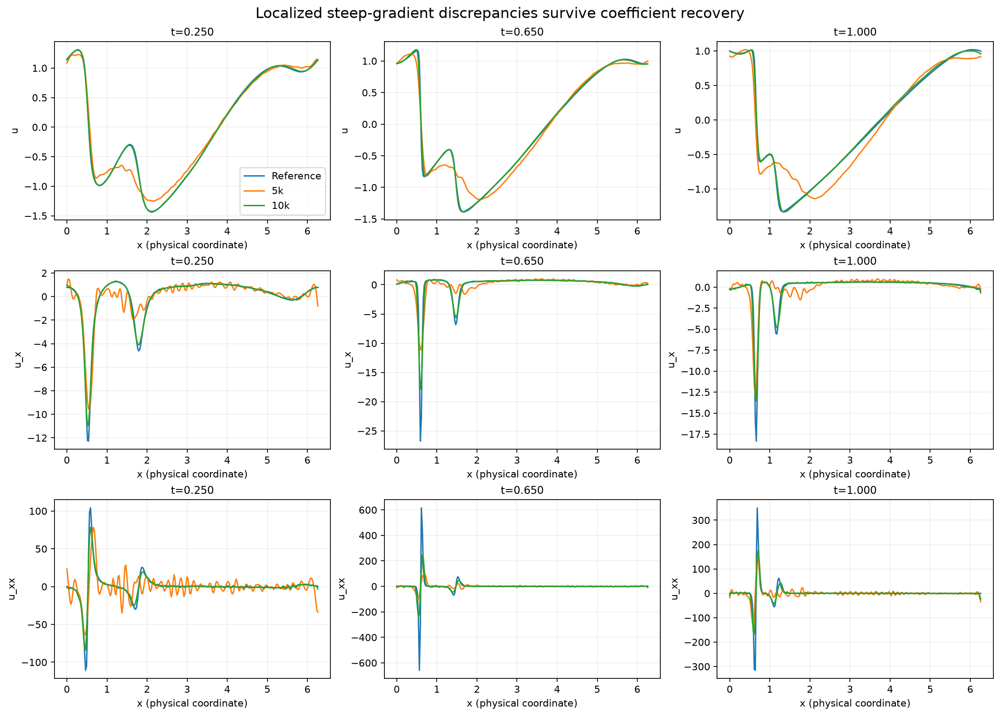

# Phase 19B: what changes between 5k and 10k?


The best-supported interpretation is **mixed, with a strong target-fidelity component and improved cancellation of transport/diffusion errors**. The regression becomes Burgers-like without improved global conditioning or disappearance of spurious alternatives. At 5k even unconstrained least squares on the learned fields favors weak transport; by 10k its optimum is close to the trained head and Burgers coefficients. Thus the difference is not only failure of the symbolic optimizer to solve the same regression problem. This is an observational comparison, not a causal explanation of the 8k–9k dynamics.

## Scope and reproducible method


Branch: `sami`. Source: `/home/ghost/ghost/pde_stuff/run_results/phase19b_long_horizon_control/`. Checkpoints: 5000, 10000, and supplementary 20000. Shared grid: 252 times × 256 spatial points, 64,512 equally weighted observations. Coordinates and clean observations are loaded from the archived matched inputs, in time-major order. The original sampled times include endpoints and alternating interior solver times; these are sample norms, not quadrature-weighted continuum norms. Physical x is periodic in [0,2π), t spans [0,1].

“Reference” means the saved numerical Burgers solution, not an analytic continuum solution. Reference spatial derivatives use the generator’s centered periodic differences; reference u_t is defined as −u·u_x + 0.02u_xx. Consequently exact-reference regression recovery is an algebraic consistency check, not independent validation of temporal discretization. Network autodiff and reference finite differences are different operators near sharp gradients. No new rollout, model fitting, training, or sweep is performed; least squares is a direct post-hoc linear solve.

Primitive evaluation and metrics use `utils.derivative_utils.evaluate_model_primitive_features` via `evaluate_diagnostic_fields`, and `evaluate_primitive_feature_metrics` via the existing `field_metrics` helper. Active primitives are `[u,u_x,u_xx]`. Nine-term ordering is verified against `prog.minimal_symnet.product_term_dict` and the existing `utils.burgers_recoverability.library`:

`u; u_x; u_xx; u^2; u*u_x; u*u_xx; u_x^2; u_x*u_xx; u_xx^2`. No intercept is added. Two-support fits explicitly use `[u*u_x,u_xx]`; all nine-term displays retain the canonical ordering.

Linear algebra uses float64 on float32 model evaluations. Raw geometry uses physical columns A. Normalized geometry uses Z_j=A_j/||A_j||₂ (no centering); ZᵀZ is the cosine Gram matrix. Pearson matrices, separately stored in metrics.json, subtract means. Raw Gram is AᵀA/N. Raw columns have different physical units, so raw condition numbers are unit-dependent. This diagnostic normalization is not the fixed primitive scaling used during training.

SVD solves Zβ≈y with relative singular-value cutoff 1e−12; physical coefficients are β_j/||A_j||₂. No normal-equation inversion is used. Orthogonal bases are thin SVD bases of unit-column matrices with the same cutoff. Principal angles are acos of singular values of Q_trueᵀQ_spurious. Rank sensitivity is reported at relative cutoffs 1e−12, 1e−8, 1e−4, 1e−2; stable rank is ||A||_F²/||A||₂². Projection energy is ||QQᵀe||²/||e||². True and spurious projections overlap and must not be added. The reference true-support residual is numerical roundoff, so its explained fraction is undefined and recorded as null.

## A. Field, derivative, true-term, and RHS fidelity


| state | quantity | MSE | RMSE | relative L2 | cosine | Pearson | RMS prediction | RMS reference |
| --- | --- | --- | --- | --- | --- | --- | --- | --- |
| 5000 | u | 0.0263309 | 0.162268 | 0.189443 | 0.981907 | 0.981908 | 0.836381 | 0.856554 |
| 5000 | u_x | 1.95594 | 1.39855 | 0.598051 | 0.80546 | 0.805463 | 1.69604 | 2.33851 |
| 5000 | u_xx | 2054.4 | 45.3255 | 0.89307 | 0.466249 | 0.466303 | 17.4553 | 50.7524 |
| 5000 | u_t | 0.802705 | 0.895938 | 0.918394 | 0.431909 | 0.441508 | 0.252397 | 0.975549 |
| 5000 | u*u_x | 1.33173 | 1.154 | 0.810983 | 0.587703 | 0.587711 | 0.915365 | 1.42297 |
| 5000 | rhs | 0.797427 | 0.892988 | 0.91537 | 0.482259 | 0.482306 | 0.729448 | 0.975549 |
| 10000 | u | 0.000729358 | 0.0270066 | 0.0315294 | 0.999503 | 0.999504 | 0.855665 | 0.856554 |
| 10000 | u_x | 0.375116 | 0.612467 | 0.261905 | 0.968831 | 0.968831 | 2.06681 | 2.33851 |
| 10000 | u_xx | 1120.93 | 33.4803 | 0.65968 | 0.799581 | 0.799584 | 26.7273 | 50.7524 |
| 10000 | u_t | 0.0467539 | 0.216226 | 0.221646 | 0.97847 | 0.978578 | 0.875715 | 0.975549 |
| 10000 | u*u_x | 0.268865 | 0.518522 | 0.364394 | 0.932569 | 0.932569 | 1.25633 | 1.42297 |
| 10000 | rhs | 0.14962 | 0.386808 | 0.396503 | 0.922437 | 0.922437 | 0.987705 | 0.975549 |
| 20000 | u | 0.000180822 | 0.013447 | 0.015699 | 0.999877 | 0.999877 | 0.85578 | 0.856554 |
| 20000 | u_x | 0.093692 | 0.306091 | 0.130891 | 0.99248 | 0.992481 | 2.21251 | 2.33851 |
| 20000 | u_xx | 506.541 | 22.5065 | 0.443456 | 0.925939 | 0.92594 | 35.1981 | 50.7524 |
| 20000 | u_t | 0.0126431 | 0.112442 | 0.11526 | 0.993856 | 0.993857 | 0.938175 | 0.975549 |
| 20000 | u*u_x | 0.0825346 | 0.287288 | 0.201894 | 0.980953 | 0.980954 | 1.31753 | 1.42297 |
| 20000 | rhs | 0.0525534 | 0.229245 | 0.234991 | 0.97252 | 0.97252 | 0.97983 | 0.975549 |

`rhs` is the Burgers combination evaluated on learned fields, not the trained symbolic RHS. u_xx is both a primitive and the true diffusion feature; its row serves both purposes. By 10k, u_xx relative error is still 0.660 and transport-term relative error is 0.364. However, u_t relative error falls 0.918→0.222 and cosine rises 0.432→0.978. Its RMS rises 0.252→0.876 toward reference 0.976: the early head sees a strongly attenuated, poorly aligned target. All derivatives becoming accurate is too strong a description.

## B. Raw and normalized feature geometry


| state | raw κ | unit-column κ | raw ranks (1e−12/1e−8/1e−4/1e−2) | normalized ranks | stable rank raw / normalized | principal angles (degrees) |
| --- | --- | --- | --- | --- | --- | --- |
| reference | 40020.2 | 7.95269 | 9 / 9 / 5 / 2 | 9 / 9 / 9 / 9 | 1.001 / 2.743 | 23.3581, 55.6932 |
| 5000 | 2749.21 | 5.81188 | 9 / 9 / 9 / 2 | 9 / 9 / 9 / 9 | 1.006 / 3.077 | 31.5770, 62.4688 |
| 10000 | 8060.58 | 6.50155 | 9 / 9 / 9 / 2 | 9 / 9 / 9 / 9 | 1.003 / 2.996 | 27.2741, 56.4550 |
| 20000 | 15709.7 | 6.97255 | 9 / 9 / 6 / 2 | 9 / 9 / 9 / 9 | 1.002 / 2.892 | 26.2662, 55.8076 |

Every library has numerical rank 9 at 1e−12. Normalized conditioning gets slightly worse (5.812→6.502), as does raw conditioning (2749→8061); the reference is still more ill-conditioned in either representation. Smallest true/spurious principal angle shrinks 31.58°→27.27° (reference 23.36°): subspaces become closer, not better separated. No numerical rank transition is present.

| feature | reference RMS / L2 norm | 5000 RMS / L2 norm | 10000 RMS / L2 norm | 20000 RMS / L2 norm |
| --- | --- | --- | --- | --- |
| u | 0.856554 / 217.558 | 0.836381 / 212.434 | 0.855665 / 217.332 | 0.85578 / 217.361 |
| u_x | 2.33851 / 593.964 | 1.69604 / 430.781 | 2.06681 / 524.954 | 2.21251 / 561.959 |
| u_xx | 50.7524 / 12890.7 | 17.4553 / 4433.51 | 26.7273 / 6788.53 | 35.1981 / 8940.04 |
| u^2 | 0.907538 / 230.507 | 0.823638 / 209.198 | 0.906898 / 230.345 | 0.90658 / 230.264 |
| u*u_x | 1.42297 / 361.423 | 0.915365 / 232.496 | 1.25633 / 319.097 | 1.31753 / 334.643 |
| u*u_xx | 38.4148 / 9757.05 | 13.6505 / 3467.12 | 21.2309 / 5392.49 | 27.2319 / 6916.68 |
| u_x^2 | 43.2593 / 10987.5 | 14.2202 / 3611.81 | 24.9942 / 6348.33 | 33.3139 / 8461.47 |
| u_x*u_xx | 858.907 / 218155 | 99.9119 / 25376.8 | 256.118 / 65052 | 431.422 / 109578 |
| u_xx^2 | 26453.4 / 6.71896e+06 | 1367.29 / 347281 | 4971.97 / 1.26284e+06 | 10032.4 / 2.54815e+06 |

**reference singular values**, descending. Raw: 6718985, 218118.7, 8446.941, 5196.522, 4433.775, 312.4341, 227.2279, 216.5098, 167.8898. Unit-column: 1.811385, 1.547914, 1.034995, 0.9747856, 0.7961671, 0.6331626, 0.3666821, 0.2833965, 0.2277701.

**5000 singular values**, descending. Raw: 347298.2, 25608.92, 3135.701, 2648.432, 2126.25, 218.1858, 209.7506, 173.7553, 126.3265. Unit-column: 1.710208, 1.562342, 1.068571, 0.9976132, 0.8665097, 0.536699, 0.4339578, 0.4282592, 0.2942606.

**10000 singular values**, descending. Raw: 1262855, 65317.55, 5420.863, 3229.089, 2543.311, 292.7997, 221.6398, 210.7255, 156.6704. Unit-column: 1.733235, 1.552707, 1.053729, 0.9902701, 0.8742359, 0.655266, 0.3436554, 0.3334521, 0.266588.

**20000 singular values**, descending. Raw: 2548163, 109812, 7066.356, 4055.953, 3176.674, 304.0292, 223.3448, 213.9301, 162.203. Unit-column: 1.763991, 1.542024, 1.045213, 0.9839504, 0.862495, 0.6493063, 0.336489, 0.3273312, 0.2529908.

| state | true term | spurious term | cosine | Pearson |
| --- | --- | --- | --- | --- |
| reference | u*u_x | u | -0.00866333 | -0.00866333 |
| reference | u*u_x | u_x | 0.0492236 | 0.0492236 |
| reference | u*u_x | u^2 | -0.00385452 | -0.00654877 |
| reference | u*u_x | u*u_xx | 0.302334 | 0.30591 |
| reference | u*u_x | u_x^2 | -0.20925 | -0.210942 |
| reference | u*u_x | u_x*u_xx | -0.660469 | -0.660469 |
| reference | u*u_x | u_xx^2 | -0.214376 | -0.215399 |
| reference | u_xx | u | -0.13472 | -0.13472 |
| reference | u_xx | u_x | -2.12863e-16 | -4.74835e-18 |
| reference | u_xx | u^2 | -0.0101586 | -0.0172594 |
| reference | u_xx | u*u_xx | 0.238935 | 0.241761 |
| reference | u_xx | u_x^2 | 0.0019586 | 0.00197444 |
| reference | u_xx | u_x*u_xx | -0.915007 | -0.915007 |
| reference | u_xx | u_xx^2 | -0.0638035 | -0.0641081 |
| 5000 | u*u_x | u | 0.00664626 | 0.00665281 |
| 5000 | u*u_x | u_x | 0.140245 | 0.140232 |
| 5000 | u*u_x | u^2 | 0.00704441 | 0.00475701 |
| 5000 | u*u_x | u*u_xx | 0.19675 | 0.203575 |
| 5000 | u*u_x | u_x^2 | -0.187016 | -0.192069 |
| 5000 | u*u_x | u_x*u_xx | -0.745017 | -0.745029 |
| 5000 | u*u_x | u_xx^2 | -0.0842657 | -0.0876606 |
| 5000 | u_xx | u | -0.217423 | -0.217466 |
| 5000 | u_xx | u_x | 0.000611562 | 0.000653683 |
| 5000 | u_xx | u^2 | -0.0536183 | -0.0771819 |
| 5000 | u_xx | u*u_xx | 0.0148823 | 0.0116772 |
| 5000 | u_xx | u_x^2 | -0.00253052 | 0.000548705 |
| 5000 | u_xx | u_x*u_xx | -0.794428 | -0.794517 |
| 5000 | u_xx | u_xx^2 | 0.0736139 | 0.0789884 |
| 10000 | u*u_x | u | -0.000920038 | -0.000919139 |
| 10000 | u*u_x | u_x | 0.0120677 | 0.0120674 |
| 10000 | u*u_x | u^2 | -0.000959672 | -0.000602618 |
| 10000 | u*u_x | u*u_xx | 0.216172 | 0.220715 |
| 10000 | u*u_x | u_x^2 | -0.183119 | -0.185723 |
| 10000 | u*u_x | u_x*u_xx | -0.647314 | -0.647314 |
| 10000 | u*u_x | u_xx^2 | -0.144662 | -0.14607 |
| 10000 | u_xx | u | -0.190497 | -0.190494 |
| 10000 | u_xx | u_x | 0.000209905 | 0.000208653 |
| 10000 | u_xx | u^2 | -0.00666411 | -0.00749123 |
| 10000 | u_xx | u*u_xx | 0.144128 | 0.146679 |
| 10000 | u_xx | u_x^2 | -6.01913e-05 | 0.000420947 |
| 10000 | u_xx | u_x*u_xx | -0.878621 | -0.878624 |
| 10000 | u_xx | u_xx^2 | 0.0204132 | 0.0210307 |

The strongest single spurious alignment for both true terms is u_x*u_xx. Its transport cosine magnitude decreases 0.745→0.647, but diffusion alignment increases 0.794→0.879 (reference 0.915). Some pairwise alignment improves, but false alternatives do not generally disappear. Full 9×9 raw Gram, cosine Gram, and Pearson matrices are in metrics.json and the labeled heatmaps.

| state | cosine(u*u_x,u_xx) | Pearson(u*u_x,u_xx) |
| --- | --- | --- |
| reference | 0.728155 | 0.728155 |
| 5000 | 0.66916 | 0.669328 |
| 10000 | 0.661542 | 0.661543 |
| 20000 | 0.685391 | 0.68539 |

## C. Identifiability and support-restricted fits


“Predicted” fits use learned features and learned u_t; “reference” target uses learned features with reference u_t (except the reference-state control); “predicted_on_reference_features” holds reference columns fixed and uses that checkpoint’s learned target. Target substitutions are algebraic comparisons, not training interventions. Coefficient error is physical Euclidean distance from truth, with term-specific units; it is not a dimensionless measure of PDE contribution.

| state | target | support | transport | diffusion | residual L2 | residual MSE | relative residual | coefficient error |
| --- | --- | --- | --- | --- | --- | --- | --- | --- |
| reference | reference | full | -1 | 0.02 | 3.6062e-13 | 2.01586e-30 | 1.45539e-15 | 5.24167e-16 |
| reference | reference | true_only | -1 | 0.02 | 4.87323e-14 | 3.68123e-32 | 1.96674e-16 | 3.46945e-18 |
| 5000 | predicted | full | -0.129899 | 0.00296267 | 19.1666 | 0.00569445 | 0.298979 | 0.890871 |
| 5000 | predicted | true_only | -0.199742 | 0.0076065 | 53.9607 | 0.0451352 | 0.84173 | 0.800354 |
| 5000 | predicted_on_reference_features | full | -0.1061 | 0.00106604 | 29.6603 | 0.0136367 | 0.46267 | 0.912706 |
| 5000 | reference | full | -0.83142 | 0.0088107 | 198.829 | 0.612798 | 0.802435 | 0.220143 |
| 5000 | reference | true_only | -0.723674 | 0.023582 | 213.772 | 0.708374 | 0.862745 | 0.276349 |
| 10000 | predicted | full | -0.904109 | 0.0166578 | 9.86917 | 0.00150981 | 0.0443709 | 0.121996 |
| 10000 | predicted | true_only | -0.910778 | 0.027636 | 44.1782 | 0.0302535 | 0.198621 | 0.089548 |
| 10000 | predicted_on_reference_features | full | -0.872945 | 0.0168331 | 38.4119 | 0.0228713 | 0.172696 | 0.135085 |
| 10000 | reference | full | -1.01145 | 0.0204181 | 39.158 | 0.0237684 | 0.158034 | 0.0514891 |
| 10000 | reference | true_only | -0.997683 | 0.0306121 | 66.268 | 0.0680718 | 0.267445 | 0.010862 |
| 20000 | predicted | full | -0.98345 | 0.0177127 | 6.27998 | 0.000611331 | 0.0263545 | 0.0193139 |
| 20000 | predicted | true_only | -0.968351 | 0.0242463 | 32.7538 | 0.0166296 | 0.137454 | 0.0319324 |
| 20000 | predicted_on_reference_features | full | -0.968696 | 0.0194132 | 17.5607 | 0.00478017 | 0.0736949 | 0.032603 |
| 20000 | reference | full | -1.00998 | 0.0183145 | 17.8234 | 0.00492425 | 0.0719318 | 0.0157904 |
| 20000 | reference | true_only | -1.00398 | 0.024972 | 38.6505 | 0.0231563 | 0.155986 | 0.00636617 |

All physical full-library coefficients:

| state | target | u | u_x | u_xx | u^2 | u*u_x | u*u_xx | u_x^2 | u_x*u_xx | u_xx^2 |
| --- | --- | --- | --- | --- | --- | --- | --- | --- | --- | --- |
| reference | reference | 1.34889e-16 | 1.43553e-16 | 0.02 | 4.31552e-16 | -1 | 9.83117e-18 | 3.15258e-18 | 3.25705e-19 | 7.93139e-21 |
| 5000 | predicted | -0.147705 | -0.109663 | 0.00296267 | -0.0493814 | -0.129899 | 0.00161123 | -0.00159997 | -0.000116069 | -2.43615e-06 |
| 5000 | predicted_on_reference_features | -0.152861 | -0.0800584 | 0.00106604 | -0.0619093 | -0.1061 | -0.00214792 | -0.00200449 | -5.69152e-05 | -2.26345e-06 |
| 5000 | reference | -0.0285696 | 0.135412 | 0.0088107 | -0.00834296 | -0.83142 | 0.00388178 | 0.0257966 | -0.00400294 | 5.42476e-06 |
| 10000 | predicted | -0.011656 | 0.0711323 | 0.0166578 | -0.0210883 | -0.904109 | -0.00273024 | 0.00521741 | -0.00130934 | -4.54018e-06 |
| 10000 | predicted_on_reference_features | -0.0216833 | 0.0346728 | 0.0168331 | -0.0203115 | -0.872945 | -0.00311747 | -0.000717211 | -6.7862e-05 | -7.53821e-07 |
| 10000 | reference | 0.0170448 | 0.0431021 | 0.0204181 | -0.0165057 | -1.01145 | -0.00552803 | 0.00816319 | -0.00136888 | -4.48407e-05 |
| 20000 | predicted | -0.00214963 | 0.00785139 | 0.0177127 | -0.00504457 | -0.98345 | -0.00130161 | -0.000274217 | -0.000649706 | -7.7851e-07 |
| 20000 | predicted_on_reference_features | -0.00435564 | 0.000511303 | 0.0194132 | -0.00742048 | -0.968696 | -0.00223187 | -0.00183357 | -2.77522e-05 | -7.41603e-07 |
| 20000 | reference | 0.00332453 | 0.011183 | 0.0183145 | -0.0020214 | -1.00998 | -0.000378392 | 0.0024856 | -0.00062344 | -6.45138e-06 |

| state | target | true-support MSE minus full MSE | fraction of true-support residual explained by additional spurious directions |
| --- | --- | --- | --- |
| reference | reference | -1.97904e-30 | None |
| 5000 | predicted | 0.0394407 | 0.873836 |
| 5000 | reference | 0.095576 | 0.134923 |
| 10000 | predicted | 0.0287437 | 0.950095 |
| 10000 | reference | 0.0443034 | 0.650834 |
| 20000 | predicted | 0.0160183 | 0.963238 |
| 20000 | reference | 0.0182321 | 0.787348 |

The last fraction uses S_perp=(I−P_true)S: it measures additional residual fitting after the true support, rather than double-counting overlapping spans. At 5k, spurious directions remove 87.4% of the best true-support residual; at 10k they remove 95.0%. The absolute MSE benefit declines 0.03944→0.02874, but ambiguity does not disappear. At 5k, the full learned regression transport is −0.1299; replacing only the target gives −0.8314 (with high residual 0.6128). Conversely, reference features with the 5k target still yield −0.1061. By 10k these three transports are −0.9041, −1.0115, and −0.8729. Target fidelity is therefore a prominent algebraic contributor; feature fidelity also matters greatly for residual accuracy.

The unrestricted LS head has coefficient error 0.8909→0.1220. The trained head transport is −0.03784→−0.89910, and its full-grid residual MSE is 0.009611→0.001567, compared with LS 0.005694→0.001510. The 10k head is close to the unconstrained residual optimum; the 5k learned regression itself does not favor Burgers. Full LS is a relaxation: one-product MinimalSymNet cannot represent every nine-term quadratic vector, and these fits do not establish optimization reachability or exact support selection.

## D. Error geometry and cancellation


Define e_t=û_t−u_t, e_c=(ûû_x)−(uu_x), e_d=û_xx−u_xx. RHS error is e_R=−e_c+0.02e_d, and closure error at true coefficients is r_B=e_t−e_R. The physical diffusion contribution is 0.02e_d, not unweighted e_d.

| state | cos(e_t,e_c) | cos(e_t,e_d) | cos(e_c,e_d) | RHS error MSE | closure MSE | RHS cancellation ratio | target/RHS cancellation ratio |
| --- | --- | --- | --- | --- | --- | --- | --- |
| 5000 | -0.57014 | 0.00291015 | 0.64814 | 0.797427 | 0.41645 | 0.370296 | 0.26026 |
| 10000 | -0.394733 | -0.0237538 | 0.817409 | 0.14962 | 0.114739 | 0.208606 | 0.584288 |
| 20000 | -0.279753 | -0.0210189 | 0.899332 | 0.0525534 | 0.0492504 | 0.1843 | 0.755414 |

RHS cancellation ratio = ||−e_c+0.02e_d||²/(||e_c||²+||0.02e_d||²): 0.370→0.209, supporting stronger spatial-term cancellation. RHS relative error nonetheless remains 0.397 at 10k; it is not exact. The analogous target/RHS ratio rises 0.260→0.584, so improved target-to-RHS error cancellation is not the explanation. Closure MSE at exact Burgers coefficients is still 0.1147 at 10k, much larger than fitted full-library MSE 0.001510; coefficient adjustment and spurious corrections remain consequential.

| state | error | span | error L2 | projected L2 | projected energy fraction | unprojected L2 |
| --- | --- | --- | --- | --- | --- | --- |
| 5000 | e_t | predicted_true | 227.561 | 91.149 | 0.160438 | 208.509 |
| 5000 | e_t | predicted_spurious | 227.561 | 75.4328 | 0.109881 | 214.695 |
| 5000 | e_t | reference_true | 227.561 | 220.1 | 0.935497 | 57.7948 |
| 5000 | e_t | reference_spurious | 227.561 | 132.224 | 0.337618 | 185.205 |
| 5000 | e_transport | predicted_true | 293.108 | 27.4416 | 0.00876525 | 291.821 |
| 5000 | e_transport | predicted_spurious | 293.108 | 49.174 | 0.0281459 | 288.954 |
| 5000 | e_transport | reference_true | 293.108 | 224.84 | 0.588426 | 188.041 |
| 5000 | e_transport | reference_spurious | 293.108 | 202.629 | 0.47791 | 211.788 |
| 5000 | e_diffusion | predicted_true | 11512.3 | 2760.88 | 0.0575134 | 11176.4 |
| 5000 | e_diffusion | predicted_spurious | 11512.3 | 5353.33 | 0.216233 | 10191.9 |
| 5000 | e_diffusion | reference_true | 11512.3 | 10824.1 | 0.884005 | 3920.87 |
| 5000 | e_diffusion | reference_spurious | 11512.3 | 10586.6 | 0.845649 | 4522.9 |
| 5000 | e_rhs | predicted_true | 226.812 | 75.7957 | 0.111676 | 213.772 |
| 5000 | e_rhs | predicted_spurious | 226.812 | 104.26 | 0.211302 | 201.429 |
| 5000 | e_rhs | reference_true | 226.812 | 169.289 | 0.557094 | 150.946 |
| 5000 | e_rhs | reference_spurious | 226.812 | 112.011 | 0.243889 | 197.223 |
| 5000 | closure_error | predicted_true | 163.909 | 154.772 | 0.891619 | 53.9607 |
| 5000 | closure_error | predicted_spurious | 163.909 | 111.449 | 0.462327 | 120.188 |
| 5000 | closure_error | reference_true | 163.909 | 84.6368 | 0.266634 | 140.366 |
| 5000 | closure_error | reference_spurious | 163.909 | 53.4302 | 0.10626 | 154.956 |
| 10000 | e_t | predicted_true | 54.9198 | 20.8787 | 0.144527 | 50.7963 |
| 10000 | e_t | predicted_spurious | 54.9198 | 32.5864 | 0.352059 | 44.2076 |
| 10000 | e_t | reference_true | 54.9198 | 30.1557 | 0.301496 | 45.9001 |
| 10000 | e_t | reference_spurious | 54.9198 | 29.3449 | 0.285501 | 46.4226 |
| 10000 | e_transport | predicted_true | 131.7 | 25.9345 | 0.0387776 | 129.122 |
| 10000 | e_transport | predicted_spurious | 131.7 | 56.5698 | 0.184499 | 118.932 |
| 10000 | e_transport | reference_true | 131.7 | 72.3933 | 0.30215 | 110.019 |
| 10000 | e_transport | reference_spurious | 131.7 | 103.468 | 0.617218 | 81.4823 |
| 10000 | e_diffusion | predicted_true | 8503.75 | 3758.08 | 0.195304 | 7628.27 |
| 10000 | e_diffusion | predicted_spurious | 8503.75 | 6510.05 | 0.586068 | 5471.1 |
| 10000 | e_diffusion | reference_true | 8503.75 | 7462.85 | 0.770175 | 4076.7 |
| 10000 | e_diffusion | reference_spurious | 8503.75 | 8116.32 | 0.910958 | 2537.51 |
| 10000 | e_rhs | predicted_true | 98.2461 | 72.5317 | 0.545036 | 66.268 |
| 10000 | e_rhs | predicted_spurious | 98.2461 | 90.0756 | 0.840589 | 39.226 |
| 10000 | e_rhs | reference_true | 98.2461 | 81.4095 | 0.686625 | 54.998 |
| 10000 | e_rhs | reference_spurious | 98.2461 | 72.7773 | 0.548733 | 65.9982 |
| 10000 | closure_error | predicted_true | 86.0351 | 73.8263 | 0.736327 | 44.1782 |
| 10000 | closure_error | predicted_spurious | 86.0351 | 83.2756 | 0.93688 | 21.6151 |
| 10000 | closure_error | reference_true | 86.0351 | 80.1692 | 0.868286 | 31.2242 |
| 10000 | closure_error | reference_spurious | 86.0351 | 66.4233 | 0.59606 | 54.6807 |

At 5k, most individual errors lie outside the spurious span (projected energies: e_t 11.0%, e_c 2.8%, e_d 21.6%); it would be misleading to claim most derivative error is cheaply representable there. At 10k those fractions increase to 35.2%, 18.4%, 58.6%. Absolute projected e_t norm falls 75.43→32.59, while projected transport and diffusion error norms actually increase (49.17→56.57 and 5353→6510). The smaller remaining closure error is much more spurious-aligned (46.2%→93.7%), explaining why relatively small spurious coefficients can still greatly lower PDE residual. Span alignment alone is not a parameter-cost measure.

Single-column projection of e_t (columns overlap; fractions do not sum):

| state | column | cosine | projection energy fraction | physical projection coefficient |
| --- | --- | --- | --- | --- |
| 5000 | u | -0.0343546 | 0.00118024 | -0.0368009 |
| 5000 | u_x | 0.0103511 | 0.000107146 | 0.00546801 |
| 5000 | u_xx | 0.0469506 | 0.00220435 | 0.00240986 |
| 5000 | u^2 | -0.0420773 | 0.0017705 | -0.045771 |
| 5000 | u*u_x | 0.327019 | 0.106942 | 0.320079 |
| 5000 | u*u_xx | 0.0361453 | 0.00130648 | 0.00237237 |
| 5000 | u_x^2 | -0.156862 | 0.0246058 | -0.00988308 |
| 5000 | u_x*u_xx | -0.0205016 | 0.000420315 | -0.000183843 |
| 5000 | u_xx^2 | -0.0218606 | 0.000477884 | -1.43245e-05 |
| 10000 | u | -0.00257351 | 6.62295e-06 | -0.000650325 |
| 10000 | u_x | 0.164781 | 0.0271529 | 0.0172392 |
| 10000 | u_xx | -0.0338278 | 0.00114432 | -0.00027367 |
| 10000 | u^2 | -0.00859464 | 7.38679e-05 | -0.00204917 |
| 10000 | u*u_x | 0.261581 | 0.0684247 | 0.0450207 |
| 10000 | u*u_xx | -0.189352 | 0.0358544 | -0.00192846 |
| 10000 | u_x^2 | -0.305152 | 0.0931176 | -0.00263989 |
| 10000 | u_x*u_xx | -0.00295902 | 8.7558e-06 | -2.49814e-06 |
| 10000 | u_xx^2 | 0.248984 | 0.061993 | 1.08281e-05 |

A useful exact linear decomposition is xi_LS−xi_truth = A⁺e_t + A⁺e_c − 0.02A⁺e_d. The following contributions add to the physical coefficient bias. This is an algebraic decomposition at each fixed checkpoint; A itself changes across checkpoints, so it is not a causal attribution.

| state | error source | transport bias contribution | diffusion bias contribution |
| --- | --- | --- | --- |
| 5000 | target | 0.701521 | -0.00584803 |
| 5000 | transport | 0.333262 | 0.0185409 |
| 5000 | diffusion | -0.164682 | -0.0297302 |
| 10000 | target | 0.107342 | -0.00376032 |
| 10000 | transport | -0.0260524 | 0.0275382 |
| 10000 | diffusion | 0.0146012 | -0.0271201 |
| 20000 | target | 0.026529 | -0.000601777 |
| 20000 | transport | -0.0171803 | 0.0118236 |
| 20000 | diffusion | 0.00720094 | -0.0135091 |

Transport bias from target error falls +0.7015→+0.1073; transport-feature and diffusion-feature contributions change +0.3333/−0.1647→−0.02605/+0.01460. At 10k the net feature-induced transport bias is −0.01145, while target-induced bias is +0.10734. For diffusion, the two feature-error contributions are +0.02754 and −0.02712: strong cancellation still matters even though each is large compared with the true diffusion coefficient 0.02.

## E. Figures and inspection notes




Figure 1. Shared full-range symmetric color limits per quantity; no percentile clipping. Error bands follow the steep-gradient region. Large second-derivative discrepancies remain localized at 10k. [PDF](figure1_error_maps.pdf)



Figure 2. Unit-L2, uncentered nine-column Gram matrices; each axis uses the physical feature names in canonical order. Persistent correlations do not imply rank deficiency. [PDF](figure2_normalized_gram.pdf)



Supplement to Figure 2. Raw AᵀA/N with common symmetric-log color scale; mixed physical units make scale domination explicit. [PDF](figure2_raw_gram.pdf)



Figure 3. Normalized and raw spectra shown separately on log axes. Normalized rank remains nine and conditioning does not improve. [PDF](figure3_singular_values.pdf)



Figure 4. Signed cosine with each true term. Some transport alignment weakens, but strong diffusion alternatives persist and strengthen. [PDF](figure4_true_spurious_alignment.pdf)



Figure 5. Unconstrained full-library LS on predicted u_t, compared with truth; second panel expands spurious coefficients. Values and small coefficients are fully tabulated above. [PDF](figure5_ls_coefficients.pdf)



Figure 6. Independent projections onto learned true/spurious spans. Fractions are not additive; closure_error=e_t+e_transport−0.02e_diffusion. [PDF](figure6_error_projections.pdf)



Figure 7. Shared x grid at t≈0.25, 0.65, 1.0; overlays expose localized steep-gradient errors behind global metrics. [PDF](figure7_physical_snapshots.pdf)

## F. Hypothesis assessment


| explanation | assessment |
| --- | --- |
| Derivative fidelity | Supported as a contributor: all reported errors fall. A blanket claim that all derivatives became accurate is contradicted by u_xx relative error 0.660 at 10k. A causal sufficiency threshold is unresolved. |
| Feature geometry | Broad improved-conditioning / disappearing-alternatives explanation is contradicted: condition numbers increase, angles shrink, and spurious residual fitting remains strong. Some transport pairwise alignment improves. |
| Error cancellation | Supported for transport-versus-diffusion errors in RHS and diffusion coefficient bias; not supported as improved target-to-RHS error cancellation. Remaining RHS/closure errors are substantial. |
| Target fidelity | Strongly supported as an algebraic contributor, particularly for transport bias, by target swaps and A⁺ error decomposition. Dominant causal driver is unresolved because fields co-evolve. |
| Mixed | Best supported overall: target fidelity, feature fidelity, and spatial error cancellation improve together, without a global identifiability/rank transition. |

The true directions become more relevant to the learned target and yield much more accurate coefficients; they do not suddenly appear as newly independent library directions. These saved states bracket, but do not resolve, the rapid 8,131–8,631 transport movement. No saved intermediate states establish event ordering, and no gradients, Adam update geometry, or causal interventions are analyzed. One trajectory cannot establish seed reliability. Reference discretization, equal observation weighting, and the nonlinear head constraint limit interpretation.

## Reproduction, validation, and output contract


From repository root, run:

```bash
OPENBLAS_NUM_THREADS=1 OMP_NUM_THREADS=2 .venv/bin/python runs/run_phase19b_transition_diagnostic.py --out run_results/phase19b_transition_diagnostic_repeat
```

The destination must not exist. This evaluates saved states only; the entrypoint never calls a training routine. For artifact-only figure/report regeneration, call `utils.phase19b_transition_plotting.render(out)` and `utils.phase19b_transition_report.render_report(out)`.

All four checkpoint MSEs at 5k/10k/20k reproduce the archived metrics; feature order and the LS coefficient-bias identity are checked. SHA-256 inventory verifies existing long-horizon files remain unchanged, and the main notebook hash is unchanged. Additional checks validate raw versus normalized LS, symbolic polynomial expansion, and the orthogonal residual-reduction identity. See validation.json. No commit or push was made.

Artifact directory: `/home/ghost/ghost/pde_stuff/run_results/phase19b_transition_diagnostic`.

- `report.md`: this standalone report with numerical tables and linked figures.
- `metrics.json`: complete geometry matrices, spectra, ranks, fits, coefficients, error geometry, canonical fidelity metrics, and trained-head coefficients.
- `fidelity.csv`, `alignments.csv`, `projections.csv`: tidy numerical tables.
- `fields.npz`: common grid plus reference/5k/10k/20k fields, permitting independent reanalysis.
- `config.json`, `validation.json`: numerical conventions, sources, and integrity checks.
- `figure1_error_maps.{png,pdf}`, `figure2_normalized_gram.{png,pdf}`, `figure2_raw_gram.{png,pdf}`, `figure3_singular_values.{png,pdf}`, `figure4_true_spurious_alignment.{png,pdf}`, `figure5_ls_coefficients.{png,pdf}`, `figure6_error_projections.{png,pdf}`, `figure7_physical_snapshots.{png,pdf}`.
- `email_summary.txt`: scientific summary sent to the confirmed recipient.

Implementation: `runs/run_phase19b_transition_diagnostic.py`, `utils/phase19b_transition.py`, `utils/transition_geometry.py`, `utils/phase19b_transition_plotting.py`, `utils/phase19b_transition_report.py`. Run documentation: `runs/PHASE19B_TRANSITION.md`.
