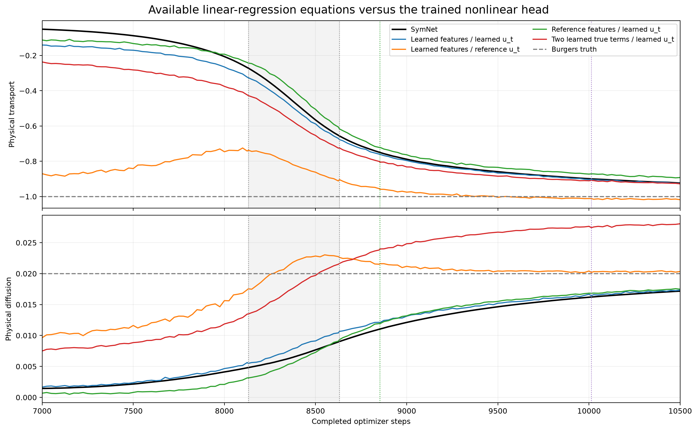
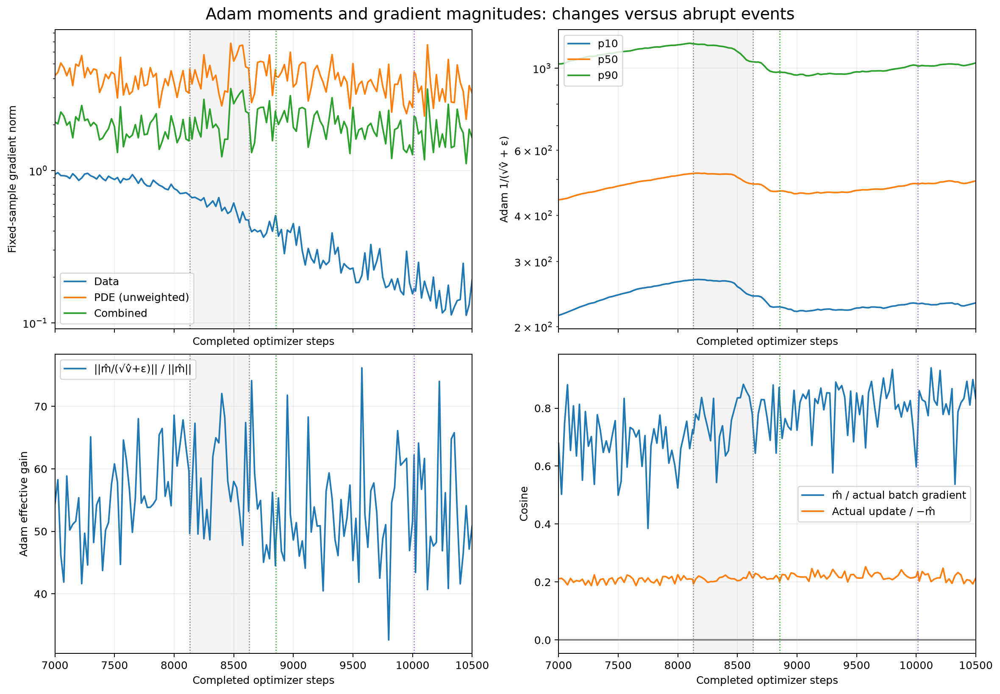
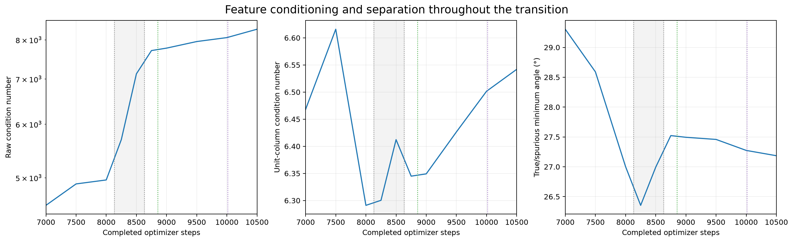
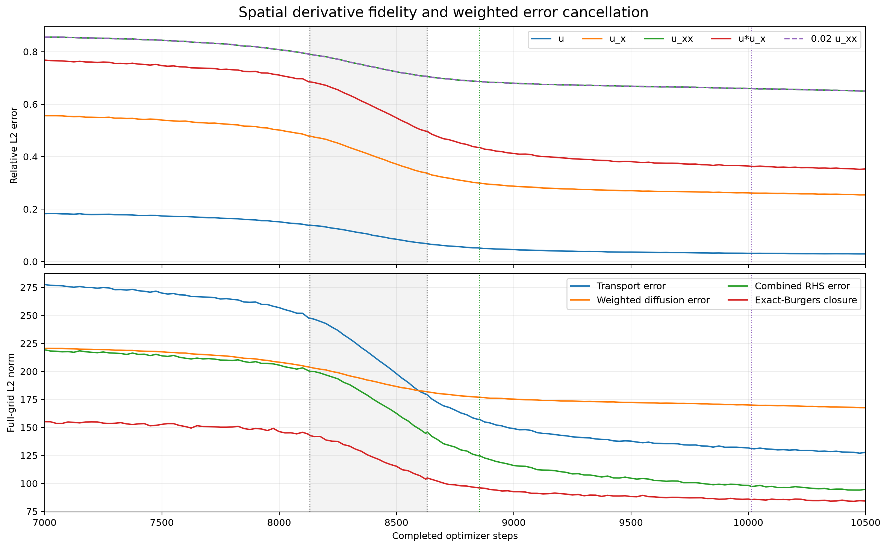

# Phase 19B: temporal ordering during recovery


The trajectory reproduced **exactly** through the transition. The most defensible description is **a coupled transition with observable-specific ordering**: learned u_t direction aligns early, transport accelerates next, and the large improvement in spatial error cancellation follows. Full u_t relative-error reduction does not clearly lead transport. No new rank/separation transition is detected, and optimizer quantities show associations and an early alignment episode rather than an established initiating switch.

The following timing observations answer the main questions without treating relative milestones as physical onsets:

- **Target alignment versus target error:** the 50% net-progress milestone for u_t cosine is 8200, transport magnitude 8425, u_t relative-L2 reduction 8525, RHS relative-L2 reduction 8550, and cancellation-ratio reduction 8775. The cosine lead holds across all five declared milestones; target relative-L2 milestones lag transport by 75–100 steps at 10–75% progress and lead by only 25 at 90%. Thus “u_t leads” is valid for directional alignment, not universally for target fidelity. Direction, amplitude and error cannot be collapsed into one event.
- **Rapid movement and peaks:** the predeclared rapid-transport slope criterion first holds at 8019. The fastest centered 200-step progress windows are centered at 8300 for u_t cosine, 8350/8375 for u_xx/u_x relative error, 8400 for transport, 8525 for RHS error, 8550 for u_t relative error, and 8600 for cancellation. These heavily overlapping windows show coupled evolution, not a sequence of isolated regime switches. The earlier archived fastest 500-step transport window 8131–8631 is reproduced.
- **Cancellation lags:** C is 0.3826 at 7000, 0.3866 at 8000 and 0.3914 at 8250: cancellation initially does not improve even as alignment and transport do. C then falls to 0.3573 at 8500, 0.2781 at loose recovery 8853, and 0.2023 at 10500. Its 10% milestone is 8475, after the rapid-transport criterion; its 50% milestone is 350 steps after transport’s midpoint. Spatial cancellation is a late/co-evolving part of recovery, not a demonstrated precursor.
- **Spatial fidelity is not one clock:** u_x/u_xx relative-error midpoints occur at 8400/8350, modestly before transport’s midpoint, whereas RHS compatibility follows it. Their early milestones are not uniformly earlier than u_t cosine. This does not establish an independent spatial-representation-first mechanism.
- **LS becomes Burgers-like only shortly before the head on its actual learned target:** full learned-feature/learned-u_t LS first meets sustained loose/strong criteria at 8825/9975, compared with exact SymNet crossings 8853/10013. That is a nominal 28/38-step lead at 25-step LS resolution, not a long interval with an already-recovered linear equation waiting for SymNet. Two-term learned-target LS reaches loose at 8700. Reference-target LS is already loose at 7000 (and in the prior 5000 diagnostic), but temporarily loses that criterion around 8000; it tests a different target. Conversely, reference features with the learned target reach loose only at 8950 and never strong by 10500. The target swap remains powerful algebraic evidence, not evidence that the actual learned regression was already recovered.
- **Optimizer observations:** actual updates are aligned with both negative fixed-sample gradients at every regular sampled point from 7825 through 8100, then data alignment turns negative again at 8125. The first 100-step-sustained episode therefore precedes rapid transport, but its cosine with −g_data is small and it is not a permanent switch. The same reversal is visible using training-batch gradients. Median Adam inverse denominator rises smoothly from 440.8 at 7000 to 520.4 at 8150, declines during/after the transition and later rises again; the 90th percentile peaks at 8100. These are measurable optimizer-state changes, not evidence of a sudden initiating preconditioner event. Actual surrogate update norm peaks at 8550 (0.00618), during recovery. The first nonnegative fixed-sample data/PDE gradient cosine sustained for 100 steps occurs only at 9625, well after loose recovery. The weighted PDE/data ratio never falls to one (minimum 1.613); its increase reflects a strongly shrinking data gradient, not necessarily worsening data fit.
- **Geometry:** unit-column condition stays between 6.291 and 6.616 at scheduled transition checkpoints; every library has numerical rank nine at 1e−12. The minimum true/spurious angle stays between 26.35° and 29.30°. Maximum adjacent normalized-condition change is 4.91%, maximum angle change 1.59°; neither declared screen fires. Raw condition grows as physical derivative scales grow. There is no observed sharp improvement in identifiability through conditioning/separation.
- **Loss behavior:** fixed-grid data/PDE/total losses fall from (0.02440, 0.009222, 0.02901) at 7000 to (0.005306, 0.005158, 0.007885) at 8500 and (0.0006283, 0.001501, 0.001379) at 10500. The data-loss decrease accelerates through the coefficient transition; PDE loss decreases with fluctuations. No threshold-step loss discontinuity is needed to explain the scalar record.

| Hypothesis | Assessment | Evidence and limitation |
| --- | --- | --- |
| H1: target-fidelity-first | **Partially supported; broad version unresolved** | Directional cosine leads transport consistently, but target relative error largely co-moves and slightly lags. The data do not establish target improvement as the cause. |
| H2: spatial-representation-first | **Not supported as a general sequence; causal claim unresolved** | Some derivative-error milestones modestly lead transport; RHS compatibility and cancellation do not. An early independent spatial-RHS prerequisite is contradicted by the measured order. |
| H3: coupled transition | **Supported observationally** | Rapid changes overlap in the 8.1k–8.8k region, with modest, observable-dependent offsets and no single leader across all fidelity measures. |
| H4: optimizer transition | **Unresolved** | A small update-alignment episode and gradual Adam scaling changes precede/during acceleration, but no unique sustained initiating switch is established. Gradient-conflict resolution before recovery is contradicted by the late sustained sign event. |
| H5: feature-geometry transition | **Contradicted at the sampled resolution** | Rank stays nine; normalized condition and principal angles show only small smooth/nonmonotone changes. Shorter unsampled fluctuations cannot be excluded. |

These distinctions are temporal precedence (cosine/relative milestones), algebraic compatibility (LS substitutions), and optimization association (gradient/update/Adam curves). **None is causal evidence.** The result does not warrant bifurcation language. Physical onsets earlier than 7000 or a unique noise-independent onset are unresolved; the event table reports declared milestones instead.


## Reproduction gate and preservation


The original trajectory **reproduced** over all 10,502 scalar rows from step 0 through 10,501. Every row was compared for data/PDE/total loss, all nine physical coefficients, coefficient error and spurious L2; recovery flags were required to match exactly. Tolerance was `abs(new−old) <= 1e−8 + 1e−6*abs(old)`. The extra row at 10,501 validates the actual update leaving the final diagnostic state. This reproduces the required prefix of the 100k run, not its unneeded later tail.

| quantity | maximum absolute discrepancy, all steps | maximum discrepancy, 5000–10000 |
| --- | --- | --- |
| data_loss | 0 | 0 |
| pde_loss | 0 | 0 |
| total_loss | 0 | 0 |
| xi_u | 0 | 0 |
| xi_u_x | 0 | 0 |
| xi_u_xx | 0 | 0 |
| xi_u^2 | 0 | 0 |
| xi_u*u_x | 0 | 0 |
| xi_u*u_xx | 0 | 0 |
| xi_u_x^2 | 0 | 0 |
| xi_u_x*u_xx | 0 | 0 |
| xi_u_xx^2 | 0 | 0 |
| coefficient_error | 0 | 0 |
| spurious_l2 | 0 | 0 |

| archived checkpoint | surrogate tensors bitwise equal | SymNet tensors bitwise equal |
| --- | --- | --- |
| 0 | True | True |
| 50 | True | True |
| 200 | True | True |
| 500 | True | True |
| 1000 | True | True |
| 2000 | True | True |
| 5000 | True | True |
| 10000 | True | True |

First exact loose recovery: **8853**. First exact strong recovery: **10013**. All original long-horizon and prior post-hoc files were SHA-256 verified unchanged before/after; the main notebook hash also matches. No architecture, regularization, optimizer, loss weight, or batch convention changed. No commit or push is part of this diagnostic.

## Exact setup, schedule and measurement definitions


Shock-forming Burgers, physical coordinates; SIREN width 64, three hidden layers, frequencies 20/1; original MinimalSymNet. Fixed transferred scales `[0.8564476370811462, 2.418001890182495, 49.38141632080078]`. Adam lr 5e−4, standard betas 0.9/0.999 and epsilon 1e−8, batch 4096, data/PDE weights 1/0.5, no added regularization. Exact original seed-19219 initialization tensors are loaded, rather than regenerated; seed-19220 batch generator is verified against archived batches, then continued. Batch zero is reused at steps 0 and 1. One optimizer step is executed per outer iteration. CPU float32, two Torch threads; software versions and git/source hashes are in provenance.json.

Full-grid diagnostics: **5000 plus every 25 steps from 7000 through 10500 inclusive, plus 8131, 8631, 8853, 10013**. That is 146 evaluations (145 in the transition). All requested special locations are retained. Additional state/update anchors 0, 50, 200, 500, 1000, 2000 give 152 saved states with their actual following updates. Geometry: 5000, 7000, 7500, 8000, 8250, 8500, 8750, 9000, 9500, 10000, 10500; reference geometry is stored too. Exact lists are in config.json.

Each saved state at s is before update s→s+1 and after s completed updates. Capture records the exact minibatch, state tensors, optimizer state and batch/global RNG states. It also saves the actual parameter displacement, ordinary combined training gradient, and post-update Adam state. Capture asserts unchanged RNG. Diagnostic gradients are evaluated **offline**, after the entire reproduction gate passes: no extra diagnostic backward/autograd operations are inserted into training. Offline training-batch losses and decomposed gradient sums are cross-checked against their captured counterparts.

All fidelity, coefficients, losses and LS representation curves use the same archived 252×256 full observation grid (64,512 unweighted points, time-major order). Canonical primitive feature evaluation/metrics are reused through field_metrics/evaluate_primitive_feature_metrics, with physical-coordinate autodiff. The reference is the saved numerical solution, with centered periodic spatial derivatives; reference u_t is its Burgers RHS, not independently measured continuum truth. Relative norms use all fixed grid entries, not time quadrature weights.

Gradients are evaluated both on the exact varying training minibatch and on fixed indices `floor(arange(4096)*64512/4096)`. The main figure uses the latter for temporal comparability. Actual Adam updates come from the varying training minibatch; their cosine with fixed-sample gradients is an out-of-batch diagnostic. Neither fixed-sample gradients nor their ratios are asserted equal to full-grid gradients. Both versions are retained in gradient_update_metrics.csv.

For surrogate θ: g_data=∇θL_data, g_PDE=∇θL_PDE, g_total=g_data+0.5g_PDE. Norm ratios are saved both unweighted and weighted; plots label the weighted ratio. Update cosines are with negative gradients. SymNet data gradient is identically zero; its PDE, weighted total, and actual update norms are retained. Adam m̂/v̂ are reconstructed from saved post-update moments. Inverse-denominator quantiles and effective gain `||m̂/(sqrt(v̂)+eps)||/||m̂||` describe adaptive scaling; momentum/gradient and update/momentum cosines distinguish momentum from coordinatewise scaling. Actual float32 displacement is measured by subtraction, so it differs slightly from a float64 formula reconstruction.

Cancellation is exactly the prior definition: e_c=ûû_x−uu_x, e_d=û_xx−u_xx, e_R=−e_c+0.02e_d; C=||e_R||²/(||e_c||²+0.02²||e_d||²). Lower C means stronger spatial cancellation. We separately save unweighted/weighted diffusion norms. Closure r=û_t−(−ûû_x+0.02û_xx), its MSE/norm, and relative norm versus learned u_t are tracked. This is not the trained-head residual.

Canonical nine-term physical ordering is `[u,u_x,u_xx,u^2,u*u_x,u*u_xx,u_x^2,u_x*u_xx,u_xx^2]`, checked against MinimalSymNet. All LS uses float64 unit-L2 column normalization (no centering/intercept), SVD cutoff 1e−12, and converts back to physical coefficients. Two-term fits explicitly order transport then diffusion. Raw and normalized geometry are separate; ranks at 1e−12, 1e−8, 1e−4, 1e−2 and spectra/Gram/Pearson matrices are retained. True/spurious angles use thin SVD orthonormal bases. Unconstrained LS is a relaxation, not a replacement or exact model of the nonlinear one-product SymNet optimization.

## Selected synchronized numerical observations


| step | u_t relative L2 | u_t cosine | RHS relative L2 | cancellation C | transport | diffusion | coefficient error | spurious L2 |
| --- | --- | --- | --- | --- | --- | --- | --- | --- |
| 5000 | 0.9183941 | 0.4319095 | 0.9153695 | 0.3702958 | -0.03784097 | 0.002659479 | 0.9875131 | 0.2216561 |
| 7000 | 0.9009653 | 0.4833136 | 0.8850433 | 0.382602 | -0.05110523 | 0.001444694 | 0.9693233 | 0.1970841 |
| 7500 | 0.8785079 | 0.5381641 | 0.8634012 | 0.3809002 | -0.08803077 | 0.002157649 | 0.9289744 | 0.1760317 |
| 8000 | 0.8098745 | 0.6617637 | 0.8299379 | 0.3866212 | -0.2063396 | 0.004113307 | 0.8096146 | 0.1591435 |
| 8131 | 0.7650706 | 0.7170893 | 0.8071949 | 0.3891319 | -0.27197 | 0.004814572 | 0.745028 | 0.157507 |
| 8250 | 0.7151205 | 0.7599277 | 0.780649 | 0.3913698 | -0.3538035 | 0.005522161 | 0.6652654 | 0.1574754 |
| 8400 | 0.6248809 | 0.8223462 | 0.707506 | 0.3733878 | -0.480484 | 0.006699839 | 0.5437082 | 0.1598276 |
| 8500 | 0.5557161 | 0.8606641 | 0.6561857 | 0.357259 | -0.5658769 | 0.007678119 | 0.4627587 | 0.1597841 |
| 8631 | 0.46719 | 0.903677 | 0.5891168 | 0.3264668 | -0.6565246 | 0.009025619 | 0.3775674 | 0.1564011 |
| 8750 | 0.4072163 | 0.9276573 | 0.5346047 | 0.2958243 | -0.7137479 | 0.01016407 | 0.3235348 | 0.1504584 |
| 8853 | 0.3648001 | 0.9422918 | 0.5040771 | 0.2780951 | -0.7502083 | 0.0110386 | 0.2886583 | 0.1443863 |
| 9000 | 0.3221553 | 0.9554307 | 0.4681887 | 0.2544011 | -0.7886722 | 0.01211243 | 0.2509691 | 0.1351438 |
| 9500 | 0.2538881 | 0.9722156 | 0.422362 | 0.2249042 | -0.8595516 | 0.01463792 | 0.1765964 | 0.1069196 |
| 10000 | 0.221646 | 0.9784695 | 0.3965026 | 0.2086058 | -0.8991029 | 0.01618729 | 0.1301216 | 0.08207833 |
| 10013 | 0.221435 | 0.9787718 | 0.3929116 | 0.2056789 | -0.9000461 | 0.01621543 | 0.1290396 | 0.08152374 |
| 10500 | 0.2051218 | 0.9813198 | 0.3824764 | 0.2022624 | -0.923912 | 0.01716895 | 0.09816108 | 0.0619532 |

| step | u relative L2 | u_x relative L2 | u_xx relative L2 | transport relative L2 | weighted diffusion relative L2 | closure MSE | fixed-grid data MSE | fixed-grid PDE MSE |
| --- | --- | --- | --- | --- | --- | --- | --- | --- |
| 5000 | 0.1894429 | 0.598051 | 0.8930697 | 0.8109833 | 0.8930697 | 0.4164496 | 0.02633091 | 0.009611417 |
| 7000 | 0.1823767 | 0.5558908 | 0.8555176 | 0.7680004 | 0.8555176 | 0.3729108 | 0.02440326 | 0.009222494 |
| 7500 | 0.173831 | 0.5392483 | 0.8435517 | 0.7468444 | 0.8435517 | 0.3616718 | 0.02216988 | 0.008869721 |
| 8000 | 0.1517853 | 0.5015639 | 0.8077305 | 0.7108987 | 0.8077305 | 0.3317296 | 0.01690318 | 0.007669464 |
| 8131 | 0.1385921 | 0.4783422 | 0.790376 | 0.6849196 | 0.790376 | 0.3160199 | 0.01409244 | 0.007510384 |
| 8250 | 0.1247387 | 0.4516573 | 0.7716424 | 0.6548926 | 0.7716424 | 0.2932874 | 0.01141594 | 0.006845318 |
| 8400 | 0.0999649 | 0.4031597 | 0.7421091 | 0.5914928 | 0.7421091 | 0.2362761 | 0.007331692 | 0.005278516 |
| 8500 | 0.08504443 | 0.371508 | 0.7234267 | 0.5478775 | 0.7234267 | 0.2063416 | 0.005306411 | 0.005157729 |
| 8631 | 0.06793535 | 0.3365461 | 0.7053317 | 0.4964979 | 0.7053317 | 0.1705722 | 0.003386108 | 0.004464974 |
| 8750 | 0.05783715 | 0.3132171 | 0.6932311 | 0.4577691 | 0.6932311 | 0.1512469 | 0.002454273 | 0.004734841 |
| 8853 | 0.05144975 | 0.2993868 | 0.6865835 | 0.4354057 | 0.6865835 | 0.1430951 | 0.001942119 | 0.003823774 |
| 9000 | 0.04584455 | 0.2874051 | 0.6798898 | 0.4120242 | 0.6798898 | 0.1329878 | 0.001542001 | 0.002936505 |
| 9500 | 0.03618768 | 0.2703828 | 0.668533 | 0.3812907 | 0.668533 | 0.1207677 | 0.0009607947 | 0.002605197 |
| 10000 | 0.0315294 | 0.2619045 | 0.6596795 | 0.3643943 | 0.6596795 | 0.114739 | 0.0007293575 | 0.001567307 |
| 10013 | 0.03160958 | 0.2613485 | 0.6592491 | 0.3628149 | 0.6592491 | 0.1135052 | 0.0007330722 | 0.002170345 |
| 10500 | 0.02926445 | 0.2545051 | 0.6499338 | 0.353549 | 0.6499338 | 0.1101364 | 0.0006283331 | 0.001500774 |

Full MSE/RMSE/relative L2, cosine, Pearson, prediction/reference RMS for every quantity and state are in transition_metrics.csv. Multiplying u_xx by 0.02 changes dimensional norms/MSE but not its relative L2 or cosine; this is intentional.

## Event table and timing limits


Criteria were written to config.json before replay. Relative milestones are first 10/25/50/75/90% of the net 7000→10500 change, sustained for 100 steps on the regular 25-step grid. They are endpoint-dependent descriptive markers, not objective physical onset times. Peaks use centered 200-step differences and do not locate an onset. Exact off-grid saved states improve coverage around known events but are excluded from regular-grid timing estimates. All reported ordering must be read alongside these definitions and sensitivity across thresholds.

| quantity | 10% | 25% | 50% | 75% | 90% |
| --- | --- | --- | --- | --- | --- |
| u_t_rel_l2 | 7900 | 8250 | 8525 | 8825 | 9275 |
| u_t_cosine | 7500 | 7850 | 8200 | 8500 | 8775 |
| u_x_rel_l2 | 7750 | 8125 | 8400 | 8675 | 9075 |
| u_xx_rel_l2 | 7675 | 8050 | 8350 | 8675 | 9400 |
| transport_rel_l2 | 7850 | 8225 | 8475 | 8775 | 9225 |
| rhs_rel_l2 | 7975 | 8325 | 8550 | 8850 | 9350 |
| rhs_cancellation_ratio | 8475 | 8575 | 8775 | 9100 | 9600 |
| xi_u*u_x | 7800 | 8150 | 8425 | 8750 | 9300 |
| xi_u_xx | 7775 | 8225 | 8675 | 9200 | 9800 |

| event | criterion | step | status |
| --- | --- | --- | --- |
| gradient_alignment | first nonnegative data/PDE cosine sustained 100 steps; fixed sample primary | 9625 | sustained at least 100 steps |
| weighted_gradient_ratio | first weighted PDE/data norm ratio <=1 sustained 100 steps | unresolved | unresolved / not met |
| update_aligned_both_losses | first update cosine with -data and -PDE both nonnegative sustained 100 steps | 7825 | sustained at least 100 steps |
| learned_learned_loose_recovery | original joint coefficient thresholds; sustained 100 steps | 8825 | sustained at least 100 steps |
| learned_learned_strong_recovery | original joint coefficient thresholds; sustained 100 steps | 9975 | sustained at least 100 steps |
| learned_reference_loose_recovery | original joint coefficient thresholds; sustained 100 steps | 7000 | left-censored at 7000 |
| learned_reference_strong_recovery | original joint coefficient thresholds; sustained 100 steps | 9000 | sustained at least 100 steps |
| reference_learned_loose_recovery | original joint coefficient thresholds; sustained 100 steps | 8950 | sustained at least 100 steps |
| reference_learned_strong_recovery | original joint coefficient thresholds; sustained 100 steps | unresolved | unresolved / not met |
| true_support_learned_loose_recovery | original joint coefficient thresholds; sustained 100 steps | 8700 | sustained at least 100 steps |
| true_support_learned_strong_recovery | original joint coefficient thresholds; sustained 100 steps | 9775 | sustained at least 100 steps |
| true_support_reference_loose_recovery | original joint coefficient thresholds; sustained 100 steps | 7000 | left-censored at 7000 |
| true_support_reference_strong_recovery | original joint coefficient thresholds; sustained 100 steps | unresolved | unresolved / not met |
| SymNet_loose_recovery | original coefficient thresholds; first exact dense crossing | 8853 | observed |
| SymNet_strong_recovery | original coefficient thresholds; first exact dense crossing | 10013 | observed |
| rapid_transport | forward 100-step mean transport movement >=0.0005/step, sustained 100 start steps | 8019 | sustained at least 100 steps |

| quantity | center of fastest 200-step net-progress rate | normalized progress / step |
| --- | --- | --- |
| u_t_rel_l2 | 8550 | 0.001012327 |
| u_t_cosine | 8300 | 0.0008798707 |
| u_x_rel_l2 | 8375 | 0.001071672 |
| u_xx_rel_l2 | 8350 | 0.0009579918 |
| transport_rel_l2 | 8475 | 0.001068028 |
| rhs_rel_l2 | 8525 | 0.001101664 |
| rhs_cancellation_ratio | 8600 | 0.001559665 |
| xi_u*u_x | 8400 | 0.0009848703 |
| xi_u_xx | 8550 | 0.000651248 |

## Least-squares versus learned head


| step | fit | transport | diffusion | residual MSE | coefficient error | spurious L2 |
| --- | --- | --- | --- | --- | --- | --- |
| 7000 | learned_learned | -0.1408411 | 0.001665463 | 0.005253888 | 0.8767093 | 0.1735771 |
| 7000 | learned_reference | -0.870732 | 0.009638558 | 0.5743019 | 0.1882241 | 0.1364212 |
| 7000 | reference_learned | -0.1123675 | 0.0006746063 | 0.0131032 | 0.9043112 | 0.1717961 |
| 7000 | true_support_learned | -0.2367564 | 0.007485449 | 0.04489891 | 0.7633462 | 0 |
| 7000 | true_support_reference | -0.8122841 | 0.02671441 | 0.6624595 | 0.187836 | 0 |
| 7500 | learned_learned | -0.1704458 | 0.002372878 | 0.005237277 | 0.8449407 | 0.1595428 |
| 7500 | learned_reference | -0.8416593 | 0.01162011 | 0.5442395 | 0.2257801 | 0.1607315 |
| 7500 | reference_learned | -0.1324823 | 0.0008046234 | 0.01464238 | 0.8836149 | 0.1667928 |
| 7500 | true_support_learned | -0.2821832 | 0.008851197 | 0.04209318 | 0.7179033 | 0 |
| 7500 | true_support_reference | -0.8380525 | 0.0284541 | 0.6179539 | 0.162168 | 0 |
| 8000 | learned_learned | -0.2651472 | 0.004656052 | 0.004733797 | 0.7507894 | 0.1531031 |
| 8000 | learned_reference | -0.7462099 | 0.01563227 | 0.4815648 | 0.3429515 | 0.2306236 |
| 8000 | reference_learned | -0.1928984 | 0.002091474 | 0.02941643 | 0.8213565 | 0.1513035 |
| 8000 | true_support_learned | -0.3753161 | 0.01186246 | 0.04033351 | 0.6247369 | 0 |
| 8000 | true_support_reference | -0.8330044 | 0.02814106 | 0.5593551 | 0.167194 | 0 |
| 8500 | learned_learned | -0.5882675 | 0.009120744 | 0.004335196 | 0.4406086 | 0.1565053 |
| 8500 | learned_reference | -0.862251 | 0.02283695 | 0.2161445 | 0.2094089 | 0.1576999 |
| 8500 | reference_learned | -0.5055509 | 0.007270302 | 0.08341295 | 0.5081834 | 0.1166554 |
| 8500 | true_support_learned | -0.6537513 | 0.01970935 | 0.03690724 | 0.3462488 | 0 |
| 8500 | true_support_reference | -0.8957643 | 0.02982785 | 0.2941439 | 0.1046979 | 0 |
| 8853 | learned_learned | -0.7608154 | 0.01209274 | 0.003247327 | 0.2775174 | 0.1405137 |
| 8853 | learned_reference | -0.9589929 | 0.02160099 | 0.07371614 | 0.1200357 | 0.1128026 |
| 8853 | reference_learned | -0.7210633 | 0.01190461 | 0.05702304 | 0.2917174 | 0.08501652 |
| 8853 | true_support_learned | -0.8050205 | 0.02397683 | 0.04135359 | 0.1950201 | 0 |
| 8853 | true_support_reference | -0.9639893 | 0.03079238 | 0.143455 | 0.03759321 | 0 |
| 9000 | learned_learned | -0.7960753 | 0.0131176 | 0.002718197 | 0.2435436 | 0.1329693 |
| 9000 | learned_reference | -0.9753414 | 0.02117505 | 0.05435948 | 0.1028607 | 0.09985439 |
| 9000 | reference_learned | -0.7633306 | 0.01318068 | 0.04653027 | 0.2494854 | 0.07863889 |
| 9000 | true_support_learned | -0.8323491 | 0.02482858 | 0.03894662 | 0.1677204 | 0 |
| 9000 | true_support_reference | -0.9731577 | 0.0306483 | 0.1167282 | 0.02887721 | 0 |
| 10000 | learned_learned | -0.9041094 | 0.01665779 | 0.001509806 | 0.1219957 | 0.07534434 |
| 10000 | learned_reference | -1.011451 | 0.0204181 | 0.02376838 | 0.05148914 | 0.05019787 |
| 10000 | reference_learned | -0.8729454 | 0.01683305 | 0.0228713 | 0.1350854 | 0.04577298 |
| 10000 | true_support_learned | -0.9107782 | 0.02763602 | 0.03025353 | 0.08954801 | 0 |
| 10000 | true_support_reference | -0.9976834 | 0.0306121 | 0.06807178 | 0.010862 | 0 |
| 10500 | learned_learned | -0.9259899 | 0.01733411 | 0.001486166 | 0.09614165 | 0.0613076 |
| 10500 | learned_reference | -1.018215 | 0.02034507 | 0.01984915 | 0.04496951 | 0.04111383 |
| 10500 | reference_learned | -0.892384 | 0.01747879 | 0.01917298 | 0.1141419 | 0.03795824 |
| 10500 | true_support_learned | -0.9283233 | 0.02805178 | 0.02850517 | 0.07212756 | 0 |
| 10500 | true_support_reference | -1.004948 | 0.03047402 | 0.06130814 | 0.01158376 | 0 |

Modes: learned_learned uses learned features/learned u_t; learned_reference swaps only the target; reference_learned swaps only the columns. true_support modes use the two learned true-term columns. These are algebraic substitutions, not interventions on the training trajectory. The full CSV includes all nine physical coefficients, recovery flags, residual norms/rank, and physical coefficient errors.

## Gradients, updates and Adam state


| step | fixed data/PDE cosine | weighted PDE/data ratio | actual update norm | relative update norm | update / −data | update / −PDE | Adam effective gain | inverse denominator median |
| --- | --- | --- | --- | --- | --- | --- | --- | --- |
| 5000 | -0.4585587 | 1.754445 | 0.00305735 | 0.0001897323 | 0.004564934 | 0.08425516 | 28.943 | 247.1859 |
| 7000 | -0.2310873 | 2.218366 | 0.00440402 | 0.0002749155 | -0.004424865 | 0.09068165 | 54.37658 | 440.7657 |
| 7500 | -0.4249213 | 2.453389 | 0.004219554 | 0.000263796 | -0.02593674 | 0.06080977 | 60.79599 | 480.3764 |
| 8000 | -0.1273441 | 2.464481 | 0.004019377 | 0.0002516393 | 0.0688528 | 0.04608987 | 68.58939 | 512.9299 |
| 8131 | -0.2638079 | 3.383135 | 0.004332855 | 0.0002713303 | 0.007906498 | 0.08973015 | 49.65288 | 519.4131 |
| 8250 | -0.02796738 | 4.331996 | 0.004672502 | 0.000292669 | 0.005631943 | 0.1113244 | 48.82558 | 518.0233 |
| 8400 | -0.3742166 | 2.440526 | 0.004300112 | 0.000269425 | -0.005259547 | 0.08247568 | 72.06308 | 517.7019 |
| 8500 | 0.102166 | 4.262687 | 0.004869562 | 0.0003051898 | 0.04854246 | 0.09913156 | 57.99956 | 507.0861 |
| 8631 | -0.1098765 | 4.653536 | 0.003987733 | 0.0002500165 | 0.04328539 | 0.1138511 | 55.32057 | 486.6413 |
| 8750 | 0.006047172 | 7.046956 | 0.00450876 | 0.0002827504 | -0.0007662208 | 0.1407129 | 45.04742 | 472.2982 |
| 8853 | 0.3775259 | 4.117046 | 0.004049644 | 0.0002540106 | 0.04754554 | 0.1255309 | 47.97116 | 465.7654 |
| 9000 | 0.2267783 | 3.943091 | 0.00352814 | 0.0002213591 | 0.01356563 | 0.1233031 | 48.62407 | 458.0085 |
| 9500 | 0.3338508 | 10.97076 | 0.003508877 | 0.000220339 | 0.05039594 | 0.1572423 | 45.34362 | 467.4643 |
| 10000 | -0.2135823 | 8.33678 | 0.002672122 | 0.0001679018 | -0.00836671 | 0.1146431 | 51.60742 | 487.7839 |
| 10013 | 0.2839077 | 13.18533 | 0.003704918 | 0.0002328008 | 0.05392214 | 0.1539757 | 62.18907 | 486.7271 |
| 10500 | 0.08534326 | 8.357508 | 0.003019867 | 0.0001898575 | 0.03307391 | 0.1709929 | 50.87225 | 496.0588 |

| step | batch data/PDE cosine | weighted PDE/data ratio | head total gradient norm | head update norm | momentum / batch total gradient | update / −momentum |
| --- | --- | --- | --- | --- | --- | --- |
| 5000 | -0.4954719 | 1.903596 | 0.005691809 | 0.0001051869 | 0.7285678 | 0.1941828 |
| 7000 | -0.088119 | 2.043357 | 0.007788114 | 0.0004575227 | 0.6785616 | 0.211184 |
| 7500 | -0.4505797 | 2.609314 | 0.01038048 | 0.0007700055 | 0.4997161 | 0.2122188 |
| 8000 | -0.183628 | 2.161296 | 0.01783614 | 0.001239372 | 0.5243525 | 0.2252868 |
| 8131 | -0.2342892 | 3.463272 | 0.0185366 | 0.001345592 | 0.7129364 | 0.1935516 |
| 8250 | -0.02876321 | 4.42946 | 0.02497064 | 0.001394358 | 0.734088 | 0.1986139 |
| 8400 | -0.3595894 | 2.592751 | 0.02143428 | 0.001261 | 0.635318 | 0.22384 |
| 8500 | 0.09396048 | 4.260801 | 0.04404255 | 0.001117468 | 0.835321 | 0.2044475 |
| 8631 | -0.1392173 | 4.417985 | 0.03428355 | 0.0008407632 | 0.7357185 | 0.2134585 |
| 8750 | -0.05305581 | 6.77976 | 0.01981777 | 0.0006469477 | 0.7648942 | 0.2094723 |
| 8853 | 0.3911907 | 4.103152 | 0.04929446 | 0.0005004193 | 0.8328707 | 0.2012875 |
| 9000 | 0.2174598 | 4.079774 | 0.01668058 | 0.0003906354 | 0.7238306 | 0.2198197 |
| 9500 | 0.3512031 | 11.46883 | 0.007100581 | 0.0002961617 | 0.8522739 | 0.2144991 |
| 10000 | -0.1508748 | 9.150525 | 0.01167838 | 0.0002061298 | 0.5974833 | 0.2186112 |
| 10013 | 0.3194431 | 13.03137 | 0.01913077 | 0.0001987003 | 0.7225301 | 0.2372085 |
| 10500 | 0.0497144 | 8.528296 | 0.01020787 | 0.0001968678 | 0.8326082 | 0.2146238 |

## Geometry checks


| step | raw condition | unit-column condition | raw rank @1e−12 | normalized rank @1e−12 | minimum angle (degrees) |
| --- | --- | --- | --- | --- | --- |
| 5000 | 2749.211 | 5.811882 | 9 | 9 | 31.57696 |
| 7000 | 4551.427 | 6.468046 | 9 | 9 | 29.30436 |
| 7500 | 4896.102 | 6.615927 | 9 | 9 | 28.58989 |
| 8000 | 4962.832 | 6.291084 | 9 | 9 | 27.00203 |
| 8250 | 5694.49 | 6.300356 | 9 | 9 | 26.35389 |
| 8500 | 7124.358 | 6.412284 | 9 | 9 | 26.99409 |
| 8750 | 7712.133 | 6.34493 | 9 | 9 | 27.52258 |
| 9000 | 7776.658 | 6.349149 | 9 | 9 | 27.49393 |
| 9500 | 7952.899 | 6.426461 | 9 | 9 | 27.45819 |
| 10000 | 8060.582 | 6.501549 | 9 | 9 | 27.27411 |
| 10500 | 8294.004 | 6.541948 | 9 | 9 | 27.1852 |

| from | to | relative normalized-condition change | minimum-angle change (degrees) | screen positive |
| --- | --- | --- | --- | --- |
| 7000 | 7500 | 0.02286339 | -0.7144752 | False |
| 7500 | 8000 | -0.04910009 | -1.587859 | False |
| 8000 | 8250 | 0.001473791 | -0.6481427 | False |
| 8250 | 8500 | 0.01776528 | 0.6402062 | False |
| 8500 | 8750 | -0.0105038 | 0.5284828 | False |
| 8750 | 9000 | 0.0006648338 | -0.02864321 | False |
| 9000 | 9500 | 0.01217672 | -0.0357455 | False |
| 9500 | 10000 | 0.01168427 | -0.1840743 | False |
| 10000 | 10500 | 0.006213757 | -0.08891451 | False |

The geometry screen is a declared coarse sampling rule, not a test for a mathematical bifurcation. Shorter events between its checkpoints remain unresolved. Full pairwise alignments and singular spectra are in geometry.json/geometry_metrics.csv.

## Figures and captions


Synchronized full-grid target/spatial fidelity, physical coefficients, fixed-grid losses, fixed-sample gradients and actual minibatch updates. Gray span: fastest archived transport window 8131–8631; dotted green/purple: loose 8853/strong 10013. Transport and diffusion use labeled separate axes. The final panel separates gradient ratio and relative update scales. [Vector PDF](figure1_synchronized_transition.pdf)


Target and Burgers-RHS error maps at 7500/8000/8500/9000/10000. Shared full-range symmetric color limits across states within each row; no percentile clipping or per-state autoscaling. Errors are prediction minus numerical reference on the shared physical grid. [Vector PDF](figure2_representation_evolution.pdf)



Physical LS and learned-head coefficients. Reference-target/reference-feature swaps diagnose algebraic compatibility; unconstrained LS differs from the trained head and does not prove reachability. [Vector PDF](figure3_ls_vs_symnet.pdf)



Fixed-sample gradient norms; actual post-update Adam inverse-denominator quantiles and effective gain; actual-batch momentum alignment and update/momentum alignment. Coordinate quantiles describe optimizer state, not a change in learning rate. [Vector PDF](figure4_adam_geometry.pdf)



Raw and unit-column condition numbers and minimum true/spurious principal angle at the declared subset. Raw units differ between columns. Geometry changes are observational. [Vector PDF](figure5_feature_geometry.pdf)



Relative errors of all spatial quantities plus dimensional weighted error/closure norms. u_xx and 0.02u_xx relative errors coincide mathematically. [Vector PDF](figure6_spatial_fidelity.pdf)

## Caveats and provenance


Temporal precedence is not causality. This is one exact joint trajectory, not a controlled intervention or seed comparison. Target, spatial fields, and coefficients share an evolving surrogate. Observation begins densely at 7000, so earlier gradual changes are left-censored; there is only a 5000 anchor outside this interval. Timing depends on the observable and milestone definition. Fixed gradient sampling is deterministic but sparse relative to the full grid; actual minibatch directions remain noisy. Coarse feature-geometry sampling cannot exclude shorter fluctuations. Numerical-reference/operator discrepancies persist at steep gradients. Large raw u_xx MSE does not imply equally poor weighted RHS fidelity. Conversely, coefficient recovery and small learned-head PDE loss do not imply accurate derivatives. No bifurcation or causal mechanism is inferred.

All scalar and field plots can be reconstructed from the saved CSV/NPZ files. Saved pre-update models, minibatches, optimizer states and actual updates permit independent gradient and full-field re-evaluation. Original artifact hashes, package versions, source hashes and reproduction checks are in provenance.json/validation.json; endpoint field and cancellation checks agree with the previous 5k/10k diagnostic.

## Artifacts and exact reproduction command


Root: `/home/ghost/ghost/pde_stuff/run_results/phase19b_transition_instrumented`.

- `report.md`, `config.json`, `validation.json`, `provenance.json`.
- `optimization_history.csv`, `reproduction_errors.csv`: every step 0–10501.
- `transition_metrics.csv`: 146 fixed-grid diagnostic states.
- `gradient_update_metrics.csv`: 292 rows (training/fixed samples).
- `ls_trajectory.csv`: 730 rows (five linear comparisons/state).
- `geometry_metrics.csv`, `geometry.json`: subset plus numerical matrices/spectra.
- `events.csv`, `events.json`, `descriptive_peak_rates.csv`, `geometry_change_screen.json`.
- `states/state_*.pt`, `updates/update_*.pt` (152 each).
- `fixed_gradient_indices.npy`, `snapshot_fields.npz`.
- Six `figure*.png` and matching `figure*.pdf` files linked above.
- `artifact_manifest.json`: final generated-file hashes and implementation hashes, added after inspection.

Protocol: `runs/PHASE19B_TRANSITION_INSTRUMENTED.md`.

```bash
OPENBLAS_NUM_THREADS=1 OMP_NUM_THREADS=2 .venv/bin/python -u runs/run_phase19b_transition_instrumented.py --out run_results/phase19b_transition_instrumented_repeat
```

The destination must not exist. To analyze a completed replay without retraining, use `--stage analyze` on its directory (analysis tables must not already exist). To regenerate only plots/report, call `utils.phase19b_instrumented_plotting.render(out)` and `utils.phase19b_instrumented_report.report(out)`.
